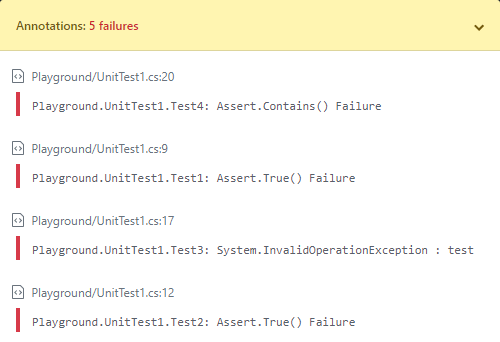

# GitHubActionsTestLogger

[](https://github.com/Tyrrrz/GitHubActionsTestLogger/actions)
[](https://nuget.org/packages/GitHubActionsTestLogger)
[](https://nuget.org/packages/GitHubActionsTestLogger)
[](https://tyrrrz.me/donate)

Custom test logger for `dotnet test` that writes output in a format that GitHub Actions understands. When using this logger, failed tests show up in annotations as well as in the list of failed checks.

The implementation relies on various heuristics to get source information because .NET test runner does not provide it, even though the contract implies it should.

## Download

- [NuGet](https://nuget.org/packages/GitHubActionsTestLogger): `dotnet add package GitHubActionsTestLogger`

## Screenshots

Failed tests are highlighted in diffs:


Failed tests are listed in annotations:



## Usage

1. Install the NuGet package in your test project

2. Ensure your test project is using the latest version of `Microsoft.NET.Test.Sdk`

3. Update your workflow so that tests are ran with custom logger:

```yaml
steps:
  # ...

  - name: Build & test
    run: dotnet test --logger GitHubActions
```
