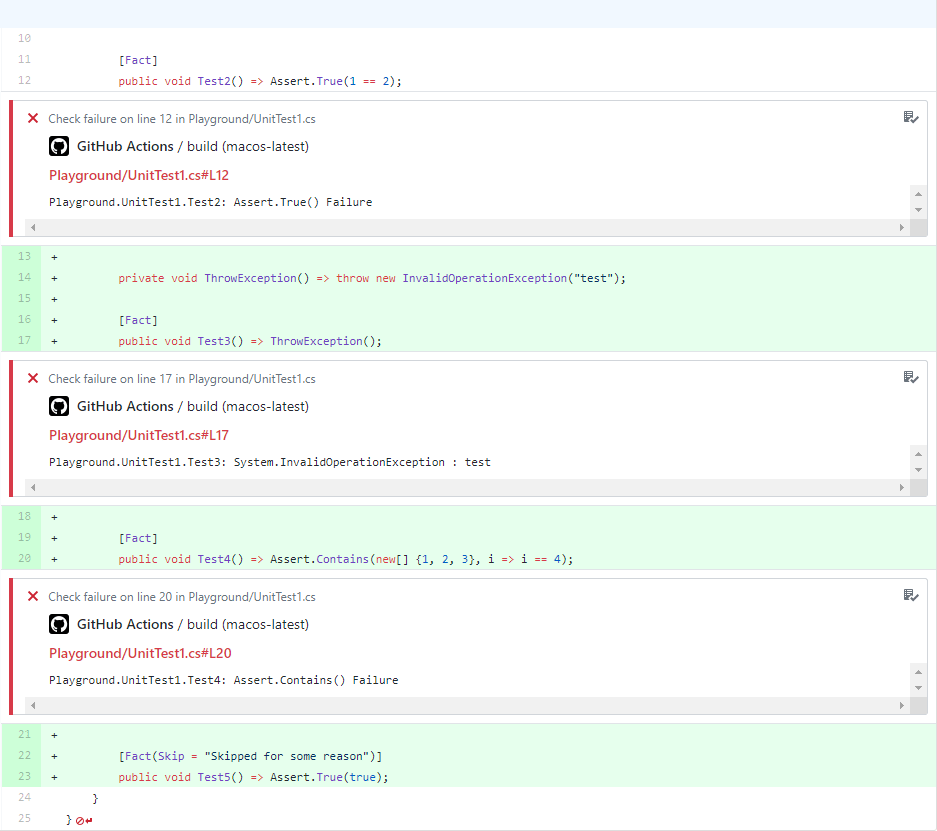
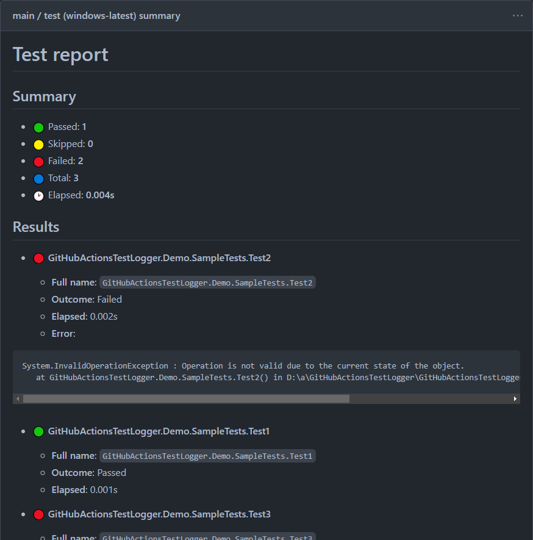

# GitHub Actions Test Logger

[](https://vshymanskyy.github.io/StandWithUkraine)
[](https://github.com/Tyrrrz/GitHubActionsTestLogger/actions)
[](https://codecov.io/gh/Tyrrrz/GitHubActionsTestLogger)
[](https://nuget.org/packages/GitHubActionsTestLogger)
[](https://nuget.org/packages/GitHubActionsTestLogger)
[](https://discord.gg/2SUWKFnHSm)
[](https://tyrrrz.me/donate)
[](https://twitter.com/tyrrrz/status/1495972128977571848)

> 🟢 **Project status**: active<sup>[[?]](https://github.com/Tyrrrz/.github/blob/master/docs/project-status.md)</sup>

Custom logger for `dotnet test` that reports test results in a structured format that GitHub Actions understands.
When using this logger, failed tests are listed in job annotations, job summary, and highlighted in code diffs.

> ⚠ Job summary is a new GitHub feature which is still in early preview.
> If your account or organization doesn't have access to this feature, job summaries will not be available.

## Terms of use

By using this project or its source code, for any purpose and in any shape or form, you grant your **implicit agreement** to all the following statements:

- You **condemn Russia and its military aggression against Ukraine**
- You **recognize that Russia is an occupant that unlawfully invaded a sovereign state**
- You **support Ukraine's territorial integrity, including its claims over temporarily occupied territories of Crimea and Donbas**
- You **reject false narratives perpetuated by Russian state propaganda**

To learn more about the war and how you can help, [click here](https://tyrrrz.me). Glory to Ukraine! 🇺🇦

## Install

- 📦 [NuGet](https://nuget.org/packages/GitHubActionsTestLogger): `dotnet add package GitHubActionsTestLogger`

## Screenshots




## Usage

### Installation

To use **GitHub Actions Test Logger**, follow these steps:

1. Install **GitHubActionsTestLogger** package in your test project
2. Install **Microsoft.NET.Test.Sdk** package in your test project (or update to latest)
3. Modify your GitHub Actions workflow file by adding `--logger GitHubActions` to `dotnet test`:

```yaml
name: CI
on: [push, pull_request]

jobs:
  build:
    runs-on: ubuntu-latest

    steps:
      - name: Checkout
        uses: actions/checkout@v2.3.3

      - name: Install .NET
        uses: actions/setup-dotnet@v1.7.2
        with:
          dotnet-version: 5.0.x

      - name: Build & test
        run: dotnet test --configuration Release --logger GitHubActions
```

> ⚠️ Ensure that your test project references **Microsoft.NET.Test.Sdk** version **16.8.0** or higher.
> Older versions of this package may not work properly with custom test loggers.

> ⚠️ If you are using **.NET SDK v2.2 or lower**, you need to enable [`<CopyLocalLockFileAssemblies>`](https://github.com/Tyrrrz/GitHubActionsTestLogger/issues/5#issuecomment-648431667) property in your test project.

### Options

**GitHub Actions Test Logger** has a few options that you can override to customize its behavior.
In order to pass an option to the logger, include it as an additional parameter inside `--logger`:

```sh
dotnet test --logger "GitHubActions;option1=foo;option2=bar"
```

#### `format`

Specifies the format used when logging test results to the console.

The following replacement tokens are available:

- `$test` — replaced with the display name of the test
- `$outcome` — replaced with the error message (in case of an exception) or the outcome of the test
- `$traits.TRAIT_NAME` — replaced with the value of a trait named `TRAIT_NAME`

Default: `$test: $outcome`.

Examples:

- `$test: $outcome` -> `MyTests.Test1: AssertionException: Expected 'true' but found 'false'`
- `[$traits.Category] $test: $outcome` -> `[UI Tests] MyTests.Test1: AssertionException: Expected 'true' but found 'false'`

#### `report-warnings`

Specifies whether to additionally report warnings for tests that have neither failed nor succeeded (i.e. skipped or inconclusive).
If disabled, only failed tests will be reported.

Can be set to either `true` or `false`.

Default: `true`.
