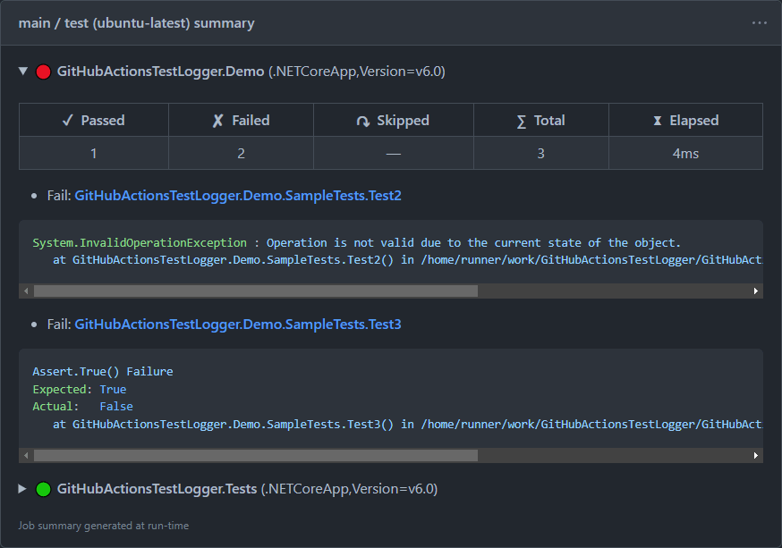

# GitHub Actions Test Logger

[](https://vshymanskyy.github.io/StandWithUkraine)
[](https://github.com/Tyrrrz/GitHubActionsTestLogger/actions)
[](https://codecov.io/gh/Tyrrrz/GitHubActionsTestLogger)
[](https://nuget.org/packages/GitHubActionsTestLogger)
[](https://nuget.org/packages/GitHubActionsTestLogger)
[](https://discord.gg/2SUWKFnHSm)
[](https://tyrrrz.me/donate)
[](https://twitter.com/tyrrrz/status/1495972128977571848)

> 🟡 **Project status**: maintenance mode<sup>[[?]](https://github.com/Tyrrrz/.github/blob/master/docs/project-status.md)</sup>

Custom logger for `dotnet test` that integrates with GitHub Actions.
When using this logger, failed tests are listed in job annotations and highlighted in code diffs.
Additionally, this logger also generates a job summary that contains detailed information about the executed test run.

## Terms of use<sup>[[?]](https://github.com/Tyrrrz/.github/blob/master/docs/why-so-political.md)</sup>

By using this project or its source code, for any purpose and in any shape or form, you grant your **implicit agreement** to all the following statements:

- You **condemn Russia and its military aggression against Ukraine**
- You **recognize that Russia is an occupant that unlawfully invaded a sovereign state**
- You **support Ukraine's territorial integrity, including its claims over temporarily occupied territories of Crimea and Donbas**
- You **reject false narratives perpetuated by Russian state propaganda**

To learn more about the war and how you can help, [click here](https://tyrrrz.me). Glory to Ukraine! 🇺🇦

## Install

- 📦 [NuGet](https://nuget.org/packages/GitHubActionsTestLogger): `dotnet add package GitHubActionsTestLogger`

## Screenshots




## Usage

### Installation

To use **GitHub Actions Test Logger**, follow these steps:

1. Install **GitHubActionsTestLogger** package in your test project
2. Update **Microsoft.NET.Test.Sdk** package in your test project to the latest version
3. Modify your GitHub Actions workflow file by adding `--logger GitHubActions` to `dotnet test`:

```yaml
name: CI
on: [push, pull_request]

jobs:
  build:
    runs-on: ubuntu-latest

    steps:
      - name: Checkout
        uses: actions/checkout@v3

      - name: Install .NET
        uses: actions/setup-dotnet@v2
        with:
          dotnet-version: 6.0.x

      - name: Build & test
        run: dotnet test --configuration Release --logger GitHubActions
```

> **Warning**:
> Ensure that your test project references **Microsoft.NET.Test.Sdk** version **17.2.0** or higher.
> Older versions of this package may not work properly with custom test loggers.

> **Warning**:
> If you are using **.NET SDK v2.2 or lower**, you need to set the `<CopyLocalLockFileAssemblies>` property to `true` in your test project.
> [Learn more](https://github.com/Tyrrrz/GitHubActionsTestLogger/issues/5#issuecomment-648431667).

### Options

When running `dotnet test`, you can customize the logger's behavior by passing additional options:

```powershell
dotnet test --logger "GitHubActions;annotations.titleFormat=$test;annotations.messageFormat=$error"
```

#### Custom annotation title

Use the `annotations.titleFormat` option to specify the annotation title format used for reporting test failures.

The following replacement tokens are available:

- `$test` — replaced with the display name of the test
- `$traits.TRAIT_NAME` — replaced with the value of the trait named `TRAIT_NAME`
- `$error` — replaced with the error message
- `$trace` — replaced with the stack trace
- `$framework` — replaced with the target framework

**Default**: `$test`.

**Examples**:

- `$test` → `MyTests.Test1`
- `[$traits.Category] $test` → `[UI Tests] MyTests.Test1`
- `$test ($framework)` → `MyTests.Test1 (.NETCoreApp,Version=v6.0)`

#### Custom annotation message

Use the `annotations.messageFormat` option to specify the annotation message format used for reporting test failures.
Supports the same replacement tokens as [`annotations.titleFormat`](#custom-annotation-title).

**Default**: `$error`.

**Examples**:

- `$error` → `AssertionException: Expected 'true' but found 'false'`
- `$error\n$trace` → `AssertionException: Expected 'true' but found 'false'`, followed by stacktrace on the next line